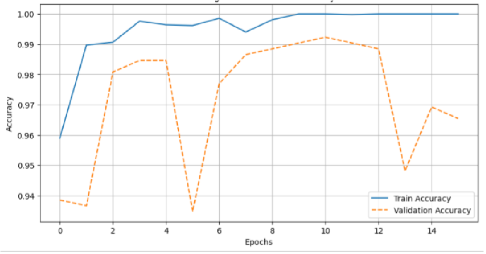
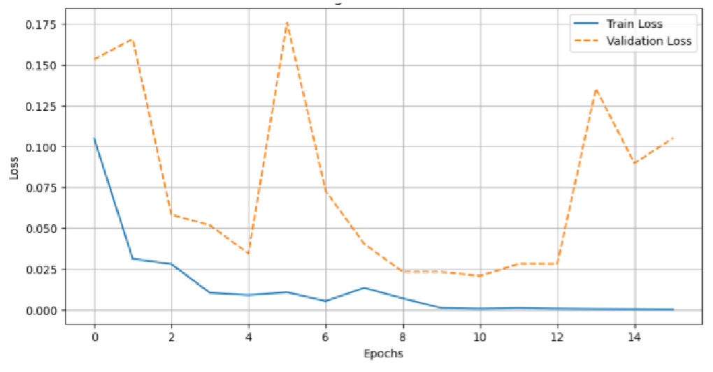
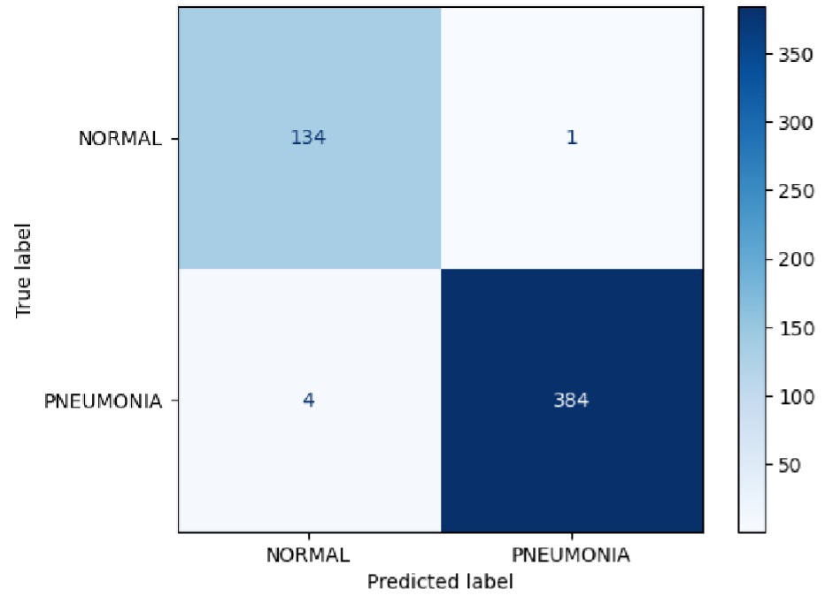
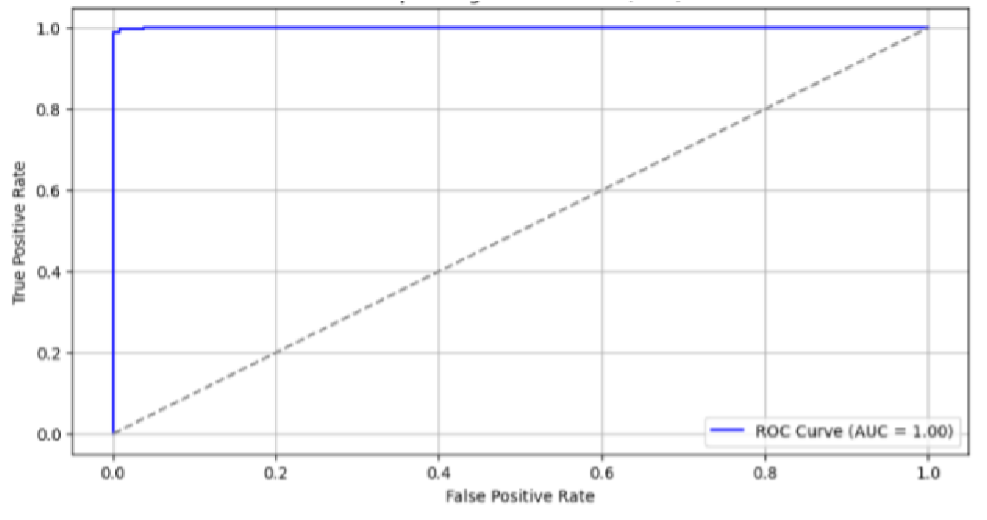
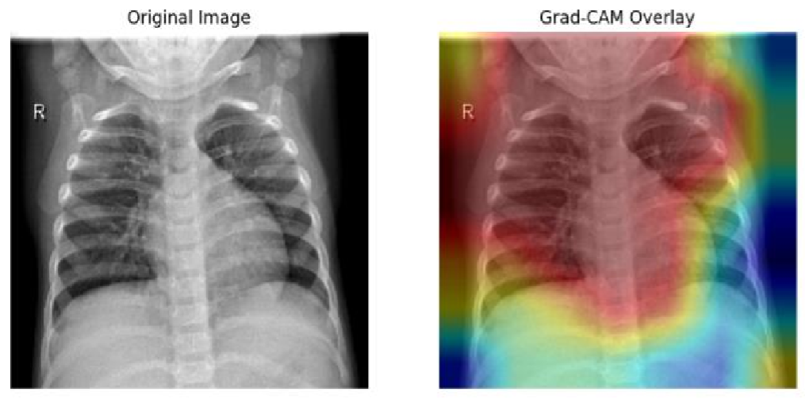

# 🫁 Ensemble Transfer Learning for Pneumonia Detection

[](https://ieeexplore.ieee.org/document/11031996)
[](https://ieeexplore.ieee.org/document/11031996)
[](https://github.com/Pragyan127/Ensemble-Transfer-Learning-for-Pneumonia-Detection)
[](https://github.com/Pragyan127/Ensemble-Transfer-Learning-for-Pneumonia-Detection/commits/main)
[](https://orcid.org/0009-0003-6690-3624)

---

> **Official IEEE code for:**  
> [Ensemble Transfer Learning for Pneumonia Detection](https://ieeexplore.ieee.org/document/11031996), presented at [ICDSBS 2025](https://www.srmist.edu.in/events/icdsbs-2025/), Coimbatore, India.

---

## 📑 Abstract

Pneumonia remains a leading global health challenge. This repository provides the official implementation of an **ensemble deep learning model** that combines DenseNet121, MobileNet, and EfficientNet (using transfer learning) for robust and accurate pneumonia detection from chest X-ray (CXR) images. Our ensemble approach achieves a **test accuracy of 99.24%** on the standard Kaggle CXR dataset, outperforming single-model baselines and most published results.

**Keywords:** Pneumonia, Deep Learning, Ensemble, Transfer Learning, DenseNet121, MobileNet, EfficientNet, Chest X-ray, Medical Imaging

---

## 👨‍💻 Authors

- [**Pragyan Dhungana**](https://github.com/Pragyan127)
- [**Shatrudhan Chaudhary**](https://github.com/jassatish)
- **Mithu Roy**
- **Rupak Aryal**
- **Pragya Dhungana**
- **Mahesh T R** (Advisor)

---

## 👥 Contributors

<table>
  <tr>
    <td align="center">
      <a href="https://github.com/pragyan127">
        
        <br /><sub><b>Pragyan Dhungana</b></sub>
      </a>
    </td>
    <td align="center">
      <a href="https://github.com/jassatish">
        
        <br /><sub><b>Shatrudhan Chaudhary</b></sub>
      </a>
    </td>
    <td align="center">
      <a href="https://github.com/Rupak1620">
        
        <br /><sub><b>Rupak Aryal</b></sub>
      </a>
    </td>
  </tr>
</table>

---

## 📰 Table of Contents

- [Introduction](#introduction)
- [Dataset](#dataset)
- [Model Architecture](#model-architecture)
- [Training & Evaluation](#training--evaluation)
- [Results & Visualizations](#results--visualizations)
- [How to Run](#how-to-run)
- [Citation](#citation)
- [Contact](#contact)

---

## 🚀 Introduction

Pneumonia is a critical respiratory disease that requires timely diagnosis. Manual reading of chest X-rays is labor-intensive and prone to error. **Transfer learning** and model **ensembling** enable highly accurate, automated detection—accelerating clinical decision-making and reducing diagnostic errors.

---

## 📂 Dataset

- **Source:** [Kaggle - Chest X-ray Images (Pneumonia)](https://www.kaggle.com/datasets/paultimothymooney/chest-xray-pneumonia)
- **Images:** 5,863 CXR images (Normal/Pneumonia)
- **Preprocessing:**  
  - Images resized to 224×224 (fits all backbones)
  - Normalization, augmentation (flip, rotate, zoom)

---

## 🏗️ Model Architecture

**Ensemble of:**
- DenseNet121
- MobileNet
- EfficientNet

All models are fine-tuned on the dataset, their outputs concatenated and passed through fully-connected layers for final prediction.

**Architecture Table:**

| Model         | Layers Unfrozen | Input Shape   | Pre-trained? | Output Shape    |
|---------------|-----------------|--------------|--------------|-----------------|
| DenseNet121   | Last 2 blocks   | 224×224×3    | ImageNet     | Feature vector  |
| MobileNet     | Last 2 blocks   | 224×224×3    | ImageNet     | Feature vector  |
| EfficientNet  | Last 2 blocks   | 224×224×3    | ImageNet     | Feature vector  |
| Ensemble Head | Dense, Dropout  | -            | -            | 2 (Softmax)     |

---

## 🏋️ Training & Evaluation

- **Loss:** Categorical Cross-Entropy
- **Optimizer:** Adam (lr=0.0001)
- **Metrics:** Accuracy, Precision, Recall, F1, ROC-AUC
- **Augmentation:** Rotation, flip, zoom, shift

**Hardware:** GPU recommended (Colab, Kaggle, or local)

---

## 📈 Results & Visualizations

| Metric     | Value      |
|------------|------------|
| Accuracy   | **99.24%** |
| Precision  | 0.99       |
| Recall     | 0.99       |
| F1-Score   | 0.99       |
| ROC-AUC    | 0.99       |

### Training Curves

<table>
  <tr>
    <td><br><div align="center"><b>Accuracy over epochs</b></div></td>
    <td><br><div align="center"><b>Loss over epochs</b></div></td>
  </tr>
</table>

---

### Confusion Matrix

<div align="center">
  <br>
  <b>Confusion Matrix</b>
</div>

---

### ROC Curve

<div align="center">
  <br>
  <b>ROC-AUC Curve</b>
</div>

---

### Sample Prediction

<div align="center">
  
  <br>
  <b>Sample X-ray: Predicted <i>Pneumonia</i> | True <i>Pneumonia</i></b>
</div>

---

## 💻 How to Run

1. **Clone this repo**
    ```bash
    git clone https://github.com/Pragyan127/Ensemble-Transfer-Learning-for-Pneumonia-Detection.git
    cd Ensemble-Transfer-Learning-for-Pneumonia-Detection
    ```

2. **[Optional] Create & activate a virtual environment**
    ```bash
    python -m venv venv
    source venv/bin/activate  # or venv\Scripts\activate on Windows
    ```

3. **Install requirements**
    ```bash
    pip install -r requirements.txt
    ```
    *(Or manually install: numpy, pandas, matplotlib, tensorflow, keras, scikit-learn, seaborn)*

4. **Download and extract the [Kaggle dataset](https://www.kaggle.com/datasets/paultimothymooney/chest-xray-pneumonia) into a folder named `/data`.**

5. **Open and run the notebook**
    ```bash
    jupyter notebook Ensemble-Transfer-Learning-for-Pneumonia-Detection.ipynb
    ```
    - Or run all cells in **VS Code**, **JupyterLab**, or **Colab**.

---

[](https://colab.research.google.com/github/Pragyan127/Ensemble-Transfer-Learning-for-Pneumonia-Detection/blob/main/Ensemble-Transfer-Learning-for-Pneumonia-Detection.ipynb)

---

## 📖 Citation

If you use this work, **please cite:**

```bibtex
@inproceedings{dhungana2024ensemble,
  title={Ensemble Transfer Learning for Pneumonia Detection},
  author={Dhungana, Pragyan and Chaudhary, Shatrudhan and Aryal, Rupak and Mahesh, T R and Rajbanshi, Ranjan Kumar and Roy, Mithu},
  booktitle={2024 International Conference on Emerging Research in Computational Science (ICERCS)},
  year={2024},
  publisher={IEEE},
  doi={10.1109/ICERCS57790.2024.11031996},
  url={https://ieeexplore.ieee.org/document/11031996}
}
